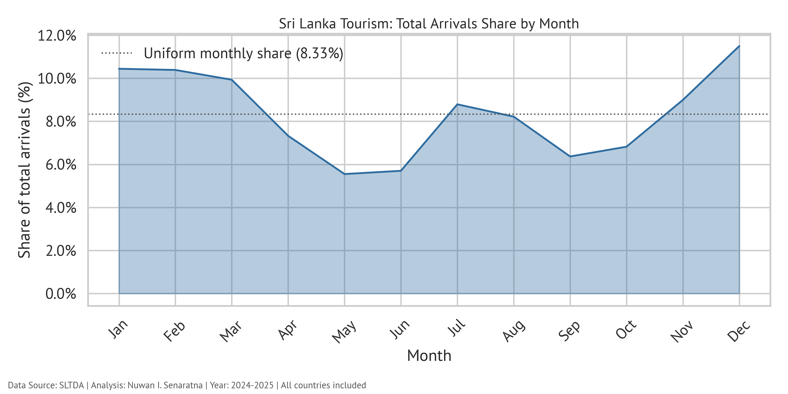
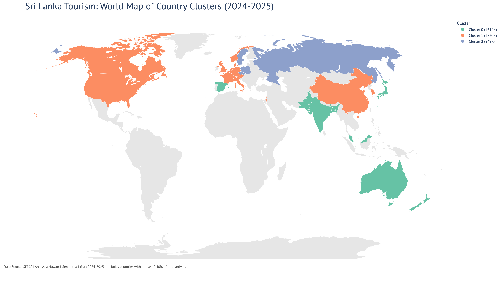
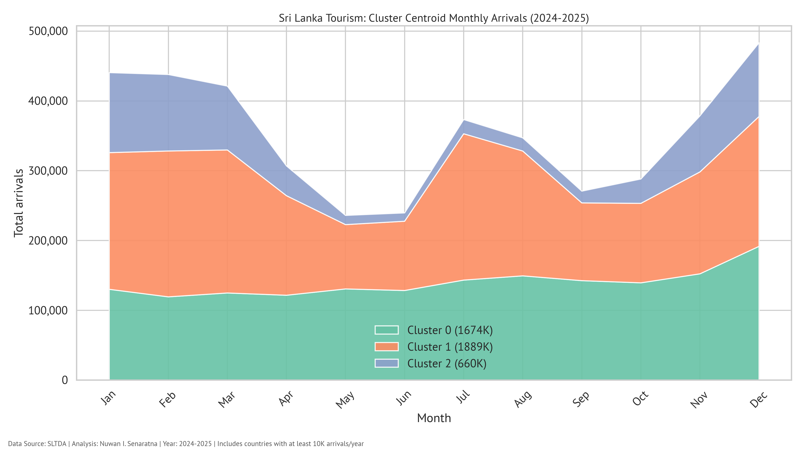
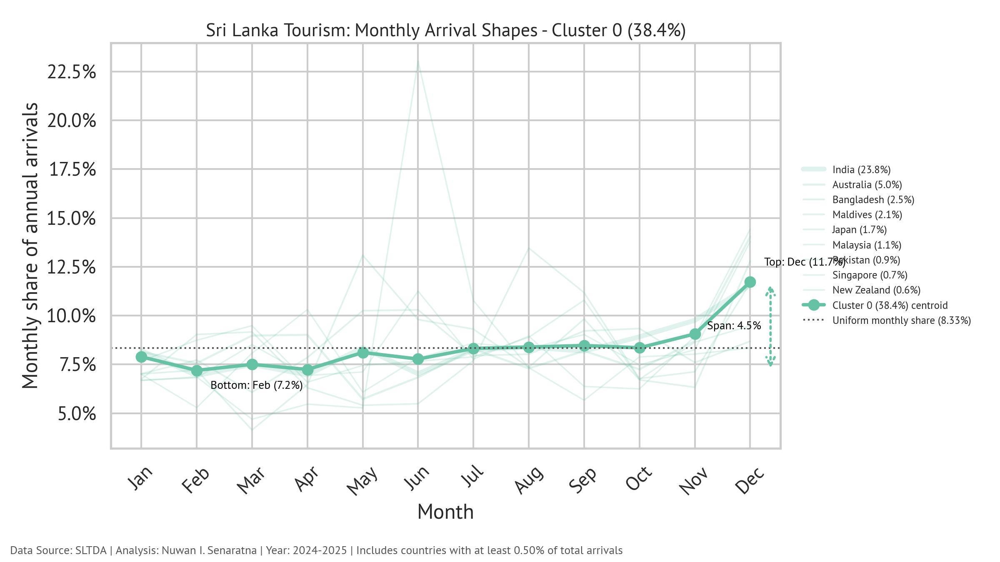
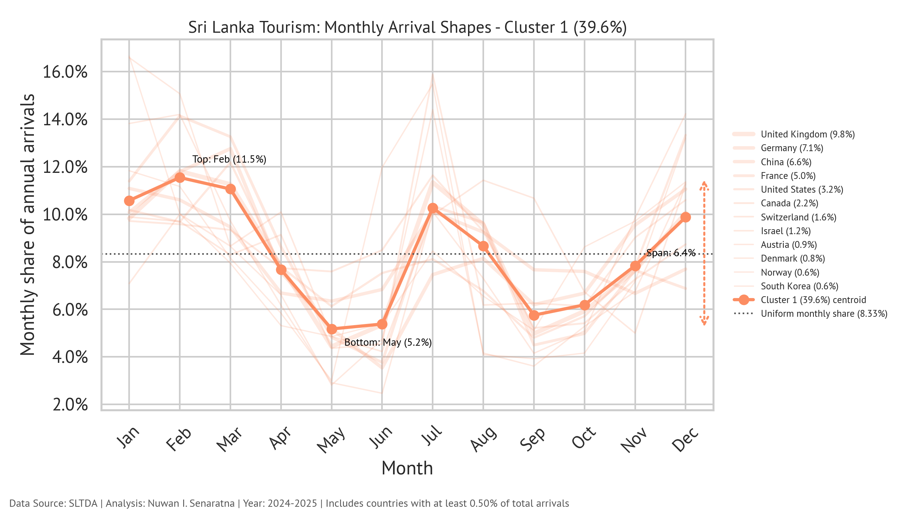
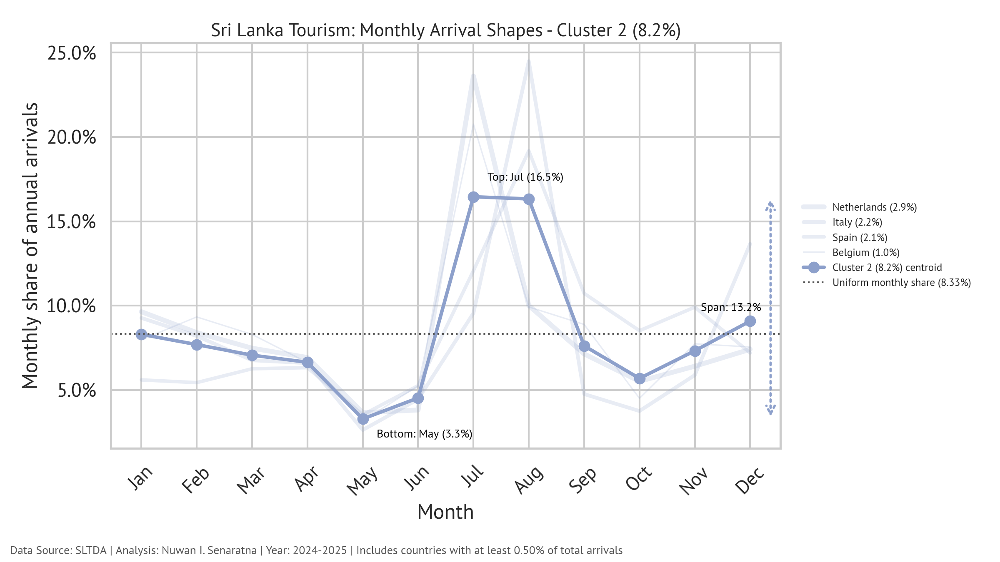
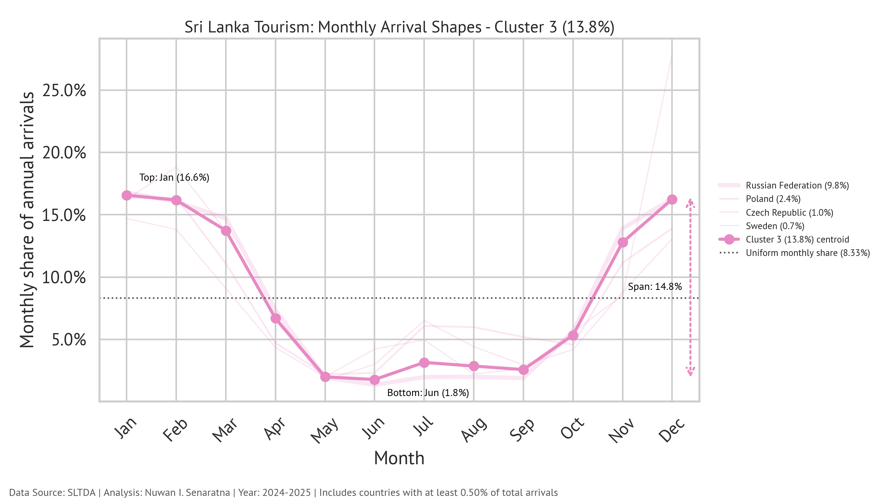
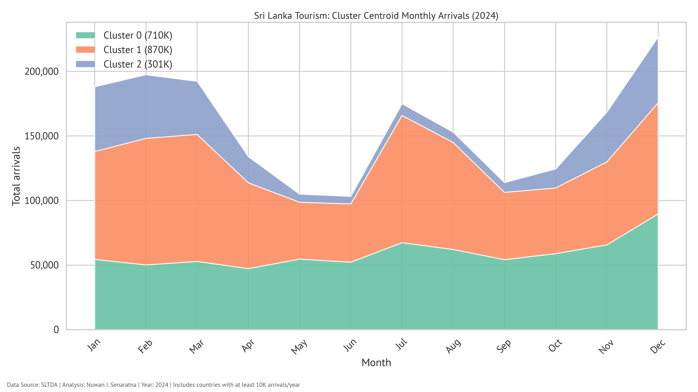
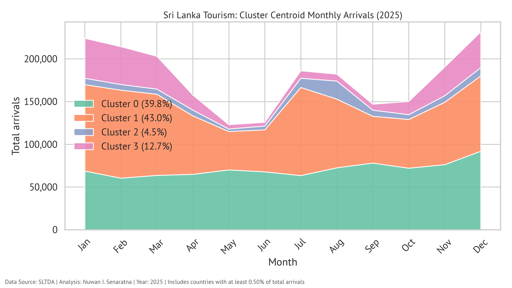

# Does Sri Lanka Have a "Tourist Season"? Yes, but it's complicated

*Analysis by Nuwan I. Senaratna · Data: Sri Lanka Tourism Development Authority · Period: 2024–2025*

## The Problem

Ask anyone who has travelled to Sri Lanka (or tried to sell a holiday there) and they'll tell you the same thing: "December and March is the *season*". In other words, our tourist season, by popular consensus, is the northern-hemisphere winter.

This feels intuitive.

The western coast and cultural triangle enjoy their driest, sunniest weather from December to March. The east coast flips, peaking in the southern-hemisphere summer. Sri Lanka sits right in the path of two monsoon systems, so *some* kind of seasonality is almost guaranteed.

But is one single "season" really the whole story?

Does every tourist-source market behave the same way?

## The Big Picture

Looking at total arrivals aggregated across all source countries and both years of the study, a seasonal signal is clearly visible:



If arrivals were perfectly evenly distributed, each of the twelve months would account for exactly **8.33%** of annual visitors. That is the baseline.

Two deviations stand out immediately:

1. **A primary peak, November → March.** This is the canonical "season." December, January, and February consistently run well above the uniform baseline, driven by northern-hemisphere winter school holidays and the search for warm weather.

2. **A secondary bump, July–August.** Smaller but clearly real — a shoulder season that the simple "winter only" narrative misses entirely.

So the single-season story is already incomplete. But the real complexity only appears when you break arrivals down by source country.

## Seasonality Is Not Universal

To investigate whether all tourists follow the same pattern, we clustered source countries by the *shape* of their monthly arrival profile — not by volume, but by *when during the year* they visit.

### Study scope

- Years analysed: **2024 and 2025** (post-COVID and post-economic-crisis recovery period; earlier data reflects supply-side disruptions rather than genuine demand patterns)
- Countries included: only those contributing **≥ 0.5% of total arrivals** to Sri Lanka over the combined period, giving a set of **29 countries** and **~3.98 million arrivals**
- Method: **k-means clustering** (k = 4) on normalised monthly arrival shares

The four clusters, mapped geographically:



The geographic grouping is striking: clusters do not form at random; nearby countries and culturally connected markets tend to land in the same cluster, pointing to shared school-holiday calendars, airline route structures, and climate preferences.

Here is how the four clusters compare on absolute centroid monthly arrivals:



## The Four Clusters

### Cluster 0 — "The Diaspora & Neighbours" (38.4% of arrivals)

**Countries:** Australia, Bangladesh, India, Japan, Malaysia, Maldives, New Zealand, Pakistan, Singapore  

**9 countries · 1,529,737 arrivals · Span: 4.5 percentage points**



This is the most *flat* cluster in the dataset.

The monthly spread runs from a low of **7.2% in February** to a high of only **11.7% in December** — a span of just 4.5 percentage points. By the standards of the other clusters, this is barely a season at all.

The composition tells the story: **India** alone dominates this cluster, and it is joined by other markets with significant Sri Lankan diaspora communities and active business travel links — Bangladesh, Pakistan, Malaysia, and Singapore. These visitors arrive throughout the year for family visits, religious events, business, and medical tourism. Their calendar is governed by the Sri Lankan calendar, not the northern-hemisphere winter.

Even the December micro-peak is modest. Someone landing in Colombo any month of the year is quite likely to be from this cluster.

### Cluster 1 — "The Classic West" (39.6% of arrivals)

**Countries:** Austria, Canada, China, Denmark, France, Germany, Israel, Norway, South Korea, Switzerland, United Kingdom, United States  

**12 countries · 1,577,958 arrivals · Span: 6.4 percentage points**



This is the cluster that confirms the conventional wisdom (at least partly).

The largest single peak is in **January–February** (topped by February at **11.5%**), aligned with northern-hemisphere winter sun-seeking. The UK, Germany, France, and Switzerland all fit this narrative comfortably.

But there is a clear **secondary peak in July (10.3%) and August (8.7%)**, driven by summer school holidays in these same markets. The trough sits in May–June (down to **5.2%**) and again in September–October (Both monsoons and school).

The pattern is a **double hump**, not a single season. Hoteliers, airlines, and tour operators targeting this cluster need pricing and marketing strategies that account for *two* distinct peaks separated by a meaningful low season.

### Cluster 2 — "The European Summer" (8.2% of arrivals)

**Countries:** Belgium, Italy, Netherlands, Spain  

**4 countries · 325,660 arrivals · Span: 13.2 percentage points**



This is arguably the most interesting and counter-intuitive cluster in the dataset.

Four countries, all Western European, all known for a strong **summer holiday culture**, produce a pattern almost the mirror-image of the classic "Sri Lanka season."

Arrivals crater in May (**3.3%**) and only begin to recover heading into summer. Then they explode: **July reaches 16.5%** and **August 16.3%**, making this cluster the most concentrated seasonal signal in the entire analysis. The combined July–August share (~33%) means that nearly **one in three annual arrivals** from Belgium, Italy, the Netherlands, and Spain happen in just two months.

What drives this? Several factors converge in July–August:

- **Peak European summer holidays** — southern European countries in particular (Italy, Spain) have culturally entrenched August holiday weeks

- The **Kandy Esala Perahera**, one of Sri Lanka's most spectacular cultural festivals, falls in July–August and is a major draw for culturally curious travellers

- Extremely hot weather across southern and western Europe in recent years has made long-haul tropical destinations comparatively attractive

That the **Netherlands** joins this cluster is probably a legacy of historical and cultural ties; the Dutch shaped the island's legal system, architecture, and place-names during their colonial period, and the connection persists in travel patterns.

### Cluster 3 — "The Classic Season" (13.8% of arrivals)

**Countries:** Czech Republic, Poland, Russian Federation, Sweden  

**4 countries · 549,291 arrivals · Span: 14.8 percentage points**



If one cluster embodies the popular idea of "the Sri Lanka season," it is this one.

Arrivals are overwhelmingly concentrated in the northern-hemisphere winter: **January (16.6%), February (16.2%), and December (16.2%)** together account for nearly **half** of all annual arrivals from this cluster.

The summer months are effectively dead: **June sits at just 1.8%** and May at 2.0%. This cluster has the most extreme seasonality of the four, with a span of **14.8 percentage points** between peak and trough.

**Russia** is the dominant force here. Russian package tourism to Sri Lanka is almost entirely a winter phenomenon; Colombo and Mirissa fill with Russian-speaking visitors from December through February, then almost completely empty. Poland, the Czech Republic, and Sweden follow a similar (if somewhat less extreme) pattern.

The geopolitical complications since early 2022 have visibly affected Russian arrivals in 2024–2025, contributing to some shift in the cluster member set relative to earlier years. Sweden's presence in this cluster rather than Cluster 1 reflects the longer, darker Scandinavian winters that reinforce a very strong winter-sun travel motivation.

## Year-on-Year Stability

The cluster assignments are broadly consistent across 2024 and 2025, suggesting these patterns reflect durable structural preferences rather than post-disruption noise. Some minor year-to-year variation in cluster membership occurs (e.g. Malaysia and South Korea switching between clusters) as recovery rates differ by market, but the core seasonal shapes are stable.





## Conclusion

Sri Lanka does have "tourist seasons" (not "a tourist season") — plural (not singular).

The popular narrative of a single November-to-March season is a reasonable first approximation for Central and Eastern European markets (Cluster 3), but it describes less than **14%** of the total analysed arrivals.

The reality is a mosaic:

| Cluster | Character | Share | Peak |
|--:|:--|--:|:--|
| 0 | Diaspora & neighbours | 38.4% | Nearly flat; small Dec uplift |
| 1 | Classic western markets | 39.6% | Double peak: Jan–Feb and Jul–Aug |
| 2 | European summer | 8.2% | Strongly Jul–Aug |
| 3 | Classic "Sri Lanka season" | 13.8% | Dec–Feb only |

**For destination marketers and hospitality operators**, this has practical implications:

- A single "shoulder season" promotion aimed at all markets simultaneously will underperform. Different source markets need different campaign timing.

- The July–August window is significantly *underappreciated*. Clusters 1 and 2 together represent nearly **48% of analysed arrivals** and both peak (Cluster 2 dramatically so) in northern-European summer.

- The flattest cluster (0) also the largest (38.4%) — and it includes India, the single largest source market. Smoothing volatility for the overall destination may depend less on marketing and more on growing this already year-round segment.

## Appendix A — References

- **Sri Lanka Tourism Development Authority (SLTDA)** — Monthly Tourist Arrival Statistics, 2024–2025. [https://www.sltda.gov.lk](https://www.sltda.gov.lk)
- **Kandy Esala Perahera** — Annual Buddhist pageant, Kandy, typically held in July–August.
- **Lloyd, S. P. (1982).** Least squares quantization in PCM. *IEEE Transactions on Information Theory*, 28(2), 129–137. *(k-means algorithm)*
- **MacQueen, J. (1967).** Some methods for classification and analysis of multivariate observations. *Proceedings of the Fifth Berkeley Symposium on Mathematical Statistics and Probability*, 1, 281–297.

## Appendix B — Code & Data

**Repository:** [github.com/nuuuwan/lk_tourism_2025](https://github.com/nuuuwan/lk_tourism_2025)

### How to run an analysis

```bash
# Install dependencies
pip install -r requirements.txt

# Run the full pipeline (data → clusters → charts → JSON output)
python workflows/tourism_seasons.py \
  --analysis-years 2024 2025 \
  --n-clusters 4 \
  --min-arrivals-percentage 0.5
```

### Appendix C: Caveats

1. **Data period.** This analysis covers 2024 and 2025 only. Both years sit in Sri Lanka's post-crisis recovery phase; arrival volumes and market mix are still normalising. Conclusions should be revisited as a longer post-recovery baseline accumulates.

2. **Country filter.** Only countries contributing ≥ 0.5% of total arrivals are included. Smaller-volume markets (many African, Middle Eastern, and Latin American countries) are excluded and may exhibit different seasonality profiles.

3. **Cluster count.** k = 4 was chosen as a parsimonious fit. A higher k would reveal sub-patterns (e.g. splitting the European summer cluster further) at the cost of interpretability.

4. **Aggregation.** Clustering uses the combined 2024–2025 profile. Some countries changed cluster between years, suggesting the annual shape is not perfectly stable.

5. **Causality.** Clustering describes *when* tourists arrive; it does not explain *why*. The interpretations offered above (diaspora links, school holidays, festivals) are plausible hypotheses, not established causal claims.
